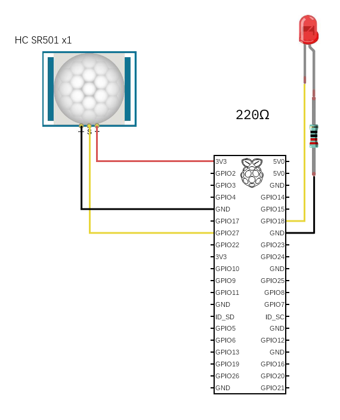

# Capteur de mouvement

Ce projet est développé avec le capteur `HC SR501`, illustré ci-dessous.

## Circuit

Schéma des branchements ci-dessous.

## Informations additionnelles[*](https://github.com/Freenove/Freenove_Ultimate_Starter_Kit_for_Raspberry_Pi/blob/master/Tutorial_GPIOZero.pdf)

0